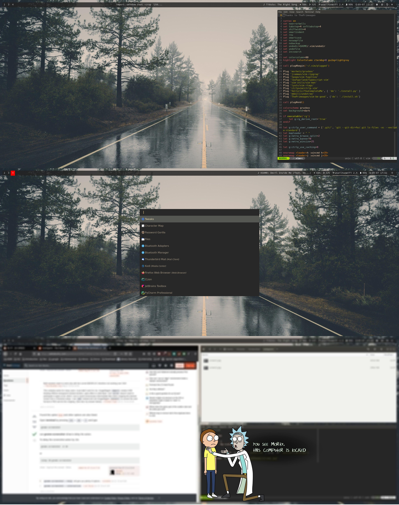

# Repository that contains all my dot files to recreate my configuration

Updated time to time

## install guide

* TBD

## required software

* i3/i3-gaps/i3-gaps-round
* vim
* feh
* dunst
* Flat-Remix-\* chose the version you prefers and change dunst config
* i3 lock
* nerdfonts
* polybar
* powerline
* rofi
* zsh

If you spot something that is missing please let me know.
If you spot something that needs to be cited please let me know, I would be
happy to cite every post and video that helped me to produce this conf
but unfortunately I'm not able to remember where I found all the sources

